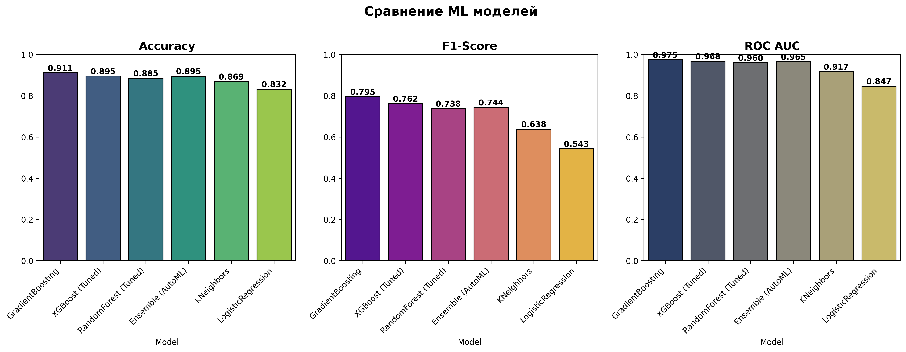

# Прогнозирование оттока клиентов туристического агентства

## 🎯 Бизнес-задача

Разработать модель для выявления клиентов с высоким риском оттока, чтобы компания могла предложить им персонализированные скидки и программы лояльности, увеличив их удержание.

**Целевая метрика:** Увеличение удержания клиентов на 15-20% за счёт своевременного выявления групп риска.

## 📊 Датасет

Используется датасет **Tour & Travels Customer Churn Prediction** с Kaggle.

**Ключевые признаки:**
- Демографические: возраст, пол, годовой доход
- Поведенческие: частота перелётов, использование услуг
- Категориальные: тип бронирования, класс обслуживания

**Целевая переменная:** `Churn` (бинарная: 0 - остался, 1 - ушёл)

## 🏗️ Архитектура пайплайна

```
┌─────────────┐     ┌──────────────┐     ┌──────────────┐     ┌─────────────┐
│   Данные    │────>│    ETL       │────>│   Обучение   │────>│   MLflow    │
│   (CSV)     │     │  (pandas)    │     │   моделей    │     │  (реестр)   │
└─────────────┘     └──────────────┘     └──────────────┘     └─────────────┘
                                                                   │
                                                                   v
┌─────────────┐     ┌──────────────┐     ┌──────────────┐     ┌─────────────┐
│  Мониторинг │<────│  Evidently   │<────│  FastAPI     │<────│  Предсказание│
│  (дрейф)    │     │   AI         │     │  сервис      │     │   (Docker)  │
└─────────────┘     └──────────────┘     └──────────────┘     └─────────────┘
```

## 🔄 ETL Процесс

### Датасет
Используется датасет **Customer Travel Churn** (954 клиента, 7 признаков).

**Признаки:**
- `Age` — возраст клиента
- `FrequentFlyer` — часто ли летает (Yes/No)
- `AnnualIncomeClass` — класс дохода (Low/Middle/High Income)
- `ServicesOpted` — количество воспользованных услуг (1-6)
- `AccountSyncedToSocialMedia` — аккаунт синхронизирован с соцсетями (Yes/No)
- `BookedHotelOrNot` — забронировал отель (Yes/No)
- `Target` — целевая переменная (Churn: 0 - остался, 1 - ушёл)

### Extract (Извлечение)
- Загрузка данных из CSV-файла
- Проверка целостности и структуры

### Transform (Трансформация)
1. **Очистка данных:**
   - Обработка пропущенных значений (медиана для чисел, мода для категорий)
   - Проверка типов данных

2. **Кодирование:**
   - LabelEncoder для категориальных признаков (Yes/No → 0/1)
   - Маппинг уровней дохода (Low/Middle/High Income → 0/1/2)

3. **Масштабирование:**
   - StandardScaler для числовых переменных (опционально)

### Load (Загрузка)
- Сохранение обработанных данных в `data/processed/processed_data.csv`
- Экспорт модели в MLflow

## 🤖 Модели

### Кастомные модели (scikit-learn / XGBoost)

**Результаты на тестовой выборке:**

| Модель | Accuracy | F1-score | ROC AUC | Precision | Recall |
|--------|----------|----------|---------|-----------|--------|
| **GradientBoosting** | **91.1%** | **79.5%** | **97.5%** | 86.8% | 73.3% |
| XGBoost (Tuned) | 89.5% | 76.2% | 96.8% | 82.1% | 71.1% |
| RandomForest (Tuned) | 88.5% | 73.8% | 96.0% | 79.5% | 68.9% |
| KNeighbors | 86.9% | 63.8% | 91.7% | 91.7% | 48.9% |
| LogisticRegression | 83.2% | 54.3% | 84.7% | 76.0% | 42.2% |

**Лучшая модель:** GradientBoosting с F1-score = 79.5% и ROC AUC = 97.5%

### AutoML модель

*В процессе добавления...*

### Визуализация



## 🧪 Тестирование

### Unit-тесты
- Проверка функций предобработки
- Валидация входных данных

### Интеграционные тесты
- Полный пайплайн от данных до предсказания

### Model & Data tests
- Проверка загрузки модели
- Валидация формата предсказаний

## 🐳 Docker & Docker Compose

Запуск всех сервисов одной командой:

```bash
docker-compose up --build
```

**Сервисы:**
- `web` — FastAPI сервис с моделью (порт 8000)
- `mlflow` — сервер для экспериментов (порт 5000)

## 🔄 CI/CD (GitHub Actions)

Автоматический пайплайн при push/pull request в `main`:
1. Установка зависимостей
2. Запуск линтеров
3. Запуск тестов (pytest)
4. Сборка и пуш Docker-образа

## 📊 Мониторинг

### MLflow
- Логирование параметров, метрик и артефактов
- Реестр моделей
- Сравнение экспериментов

### Evidently AI
- Отслеживание дрейфа данных (data drift)
- Мониторинг качества предсказаний
- HTML-отчёты и дашборды

## 📁 Структура проекта

```
.
├── data/
│   ├── raw/              # Сырые данные
│   └── processed/        # Обработанные данные
├── src/
│   ├── api/              # FastAPI приложение
│   ├── etl/              # ETL пайплайн
│   ├── models/           # Код моделей
│   ├── training/         # Скрипты обучения
│   └── utils/            # Утилиты
├── tests/                # Тесты
├── .github/
│   └── workflows/        # CI/CD пайплайны
├── reports/              # Отчёты и визуализации
├── requirements.txt
├── Dockerfile
├── docker-compose.yml
└── README.md
```

## 🚀 Быстрый старт

### Локальная установка

```bash
# Создание виртуального окружения
python -m venv venv
source venv/bin/activate  # Linux/Mac
venv\Scripts\activate     # Windows

# Установка зависимостей
pip install -r requirements.txt

# Запуск FastAPI
uvicorn src.api.main:app --reload

# Запуск тестов
pytest tests/ -v --cov=src

# Запуск через Docker
docker-compose up --build
```

## 📈 API Endpoints

- `GET /` — Главная страница
- `POST /predict` — Предсказание оттока
- `GET /health` — Проверка здоровья сервиса

## 📝 Команды Git

Основные команды, использованные в проекте:

```bash
git init
git add .
git commit -m "Initial commit: project structure"
git branch -M main
git remote add origin <repository-url>
git push -u origin main
```

## 📄 Лицензия

Проект создан в учебных целях.
