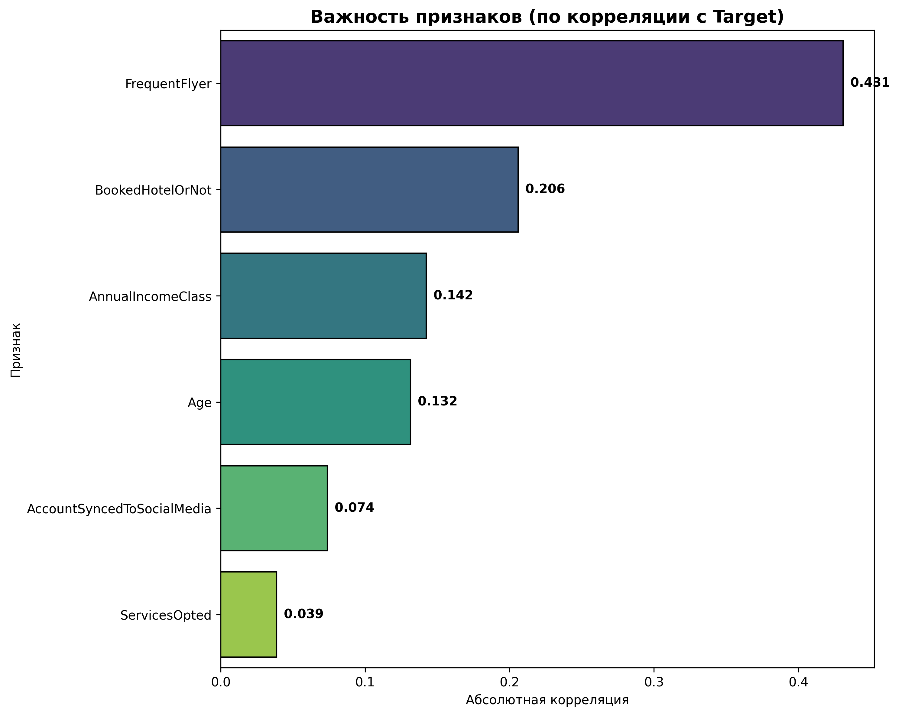
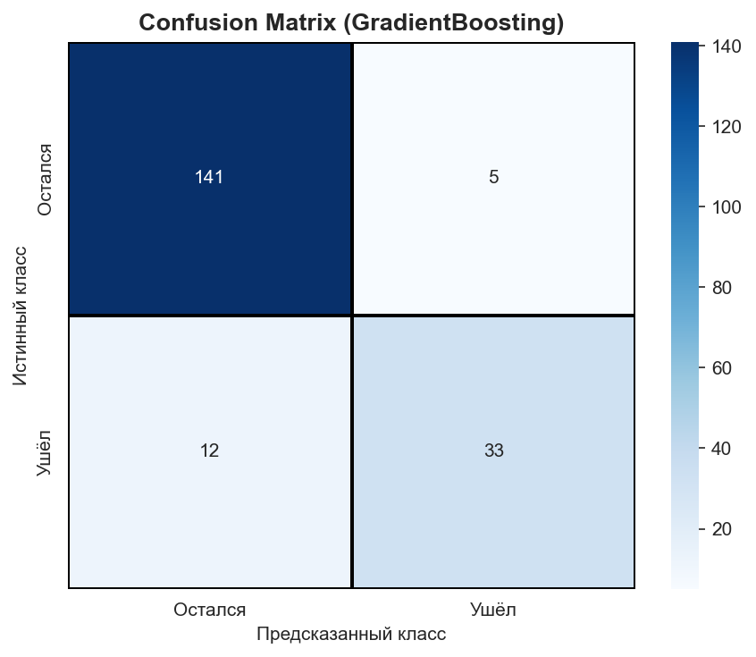
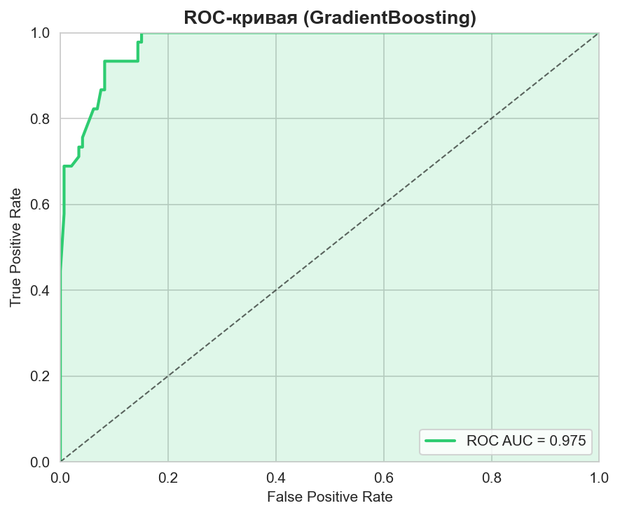

# Отчёт по учебному проекту

**Студент:** Калинина Виктория Андреевна

**Название задания:** Итоговый проект по дисциплине Автоматизация машинного обучения

**GitHub-репозиторий:** [https://github.com/vikalinet/travel-churn-prediction](https://github.com/vikalinet/travel-churn-prediction)

**Презентация проекта:** [Смотреть презентацию](presentation.html) (включая все метрики качества: Accuracy, Precision, Recall, F1-Score, ROC AUC)

**Отчёты и визуализации:** [reports/](reports/)

---

## Содержание

1. [Описание проекта](#1-описание-проекта)
2. [AutoML и кастомная модель](#2-automl-и-кастомная-модель)
3. [Тестирование](#3-тестирование)
4. [Создание контейнера для пайплайна (Docker)](#4-создание-контейнера-для-пайплайна-docker)
5. [CI/CD](#5-cicd)
6. [Мониторинг](#6-мониторинг)
   - 6.1 [Мониторинг качества модели](#61-мониторинг-качества-модели)
   - 6.2 [Мониторинг инфраструктуры](#62-мониторинг-инфраструктуры)
   - 6.3 [Мониторинг дрейфа данных — автоматизация](#63-мониторинг-дрейфа-данных--автоматизация)
   - 6.4 [Автоматический мониторинг дрейфа (GitHub Actions)](#64-автоматический-мониторинг-дрейфа-github-actions)
7. [GitHub-репозиторий](#7-github-репозиторий)
8. [Презентация](#8-презентация)
9. [Деплой на Railway](#9-деплой-на-railway)
10. [Быстрый старт](#10-быстрый-старт)

---

## 1. Описание проекта

### 1.1 Бизнес-задача

Туристическое агентство сталкивается с оттоком клиентов. Без системы раннего предупреждения компания тратит ресурсы на массовые кампании удержания, которые неэффективны и раздражают лояльных клиентов.

**Ключевой вопрос:** Как предсказать, какие клиенты собираются уйти, чтобы предложить им персонализированные скидки и программы лояльности?

**Целевая метрика:** Увеличение удержания клиентов на 15–20% за счёт своевременного выявления групп риска.

**Ожидаемый эффект (гипотеза для пилотного внедрения):**
- Сокращение расходов на удержание на 30% (таргетированное удержание вместо массового)
- Рост повторных продаж на 15%
- Повышение удовлетворённости клиентов

### 1.2 Схема пайплайна

```
┌─────────────┐     ┌──────────────┐     ┌──────────────┐     ┌─────────────┐
│   Данные    │────>│    ETL       │────>│   Обучение   │────>│   MLflow    │
│   (CSV)     │     │  (pandas)    │     │   моделей    │     │  (реестр)   │
└─────────────┘     └──────────────┘     └──────────────┘     └─────────────┘
                                                                   │
                                                                   v
┌─────────────┐     ┌──────────────┐     ┌──────────────┐     ┌─────────────┐
│  Мониторинг │<────│  Evidently   │<────│  FastAPI     │<────│  Предсказание│
│  (дрейф)    │     │   AI         │     │  сервис      │     │   (Docker)  │
└─────────────┘     └──────────────┘     └──────────────┘     └─────────────┘
```

### 1.3 Элементы ETL (Extract, Transform, Load)

**Источник данных:** датасет Customer Travel Churn (954 клиента, 7 признаков), файл `data/raw/Customertravel.csv`.

**Extract (Извлечение):**
- Загрузка CSV-файла через `pandas.read_csv()`
- Проверка целостности и структуры данных

**Transform (Трансформация):**
1. Очистка данных: обработка пропущенных значений (медиана для числовых, мода для категориальных)
2. Кодирование категориальных признаков через `LabelEncoder`:
   - Yes/No → 0/1
   - AnnualIncomeClass: Low/Middle/High → 0/1/2
3. Генерация новых признаков: `travel_frequency_score`
4. Проверка типов данных и диапазонов значений

**Load (Загрузка):**
- Сохранение обработанных данных в `data/processed/processed_data.csv`
- Экспорт обученной модели в `models/best_model.pkl`
- Логирование экспериментов в MLflow

### 1.4 Архитектура ML-модели

Обучено и сравнено **10 моделей** классификации (9 кастомных + 1 AutoML):

| Модель | Accuracy | F1-score | ROC AUC | Precision | Recall | Порог |
|--------|----------|----------|---------|-----------|--------|-------|
| **GradientBoosting_Balanced** 🏆 | **91.6%** | **81.8%** | 96.1% | 83.7% | **80.0%** | 0.41 |
| **Stacking** | 90.1% | 81.6% | **96.9%** | 72.4% | **93.3%** | 0.31 |
| RandomForest_Balanced | 90.6% | 81.3% | 96.6% | 76.5% | 86.7% | 0.42 |
| XGBoost_Balanced | 91.1% | 80.9% | 96.9% | 81.8% | 80.0% | 0.64 |
| LogisticRegression_Balanced | 85.3% | 70.8% | 88.9% | 66.7% | 75.6% | 0.54 |
| GradientBoosting (базовая) | 91.1% | 79.5% | 97.5% | 86.8% | 73.3% | 0.50 |
| XGBoost (Tuned, Optuna) | 90.1% | 77.1% | 96.7% | 84.2% | 71.1% | 0.50 |
| RandomForest | 89.5% | 76.2% | 95.7% | 82.1% | 71.1% | 0.50 |
| XGBoost | 89.5% | 76.2% | 97.0% | 82.1% | 71.1% | 0.50 |
| KNeighbors | 89.5% | 75.6% | 94.8% | 83.8% | 68.9% | 0.50 |
| RandomForest (Tuned, Optuna) | 88.5% | 73.2% | 96.0% | 81.1% | 66.7% | 0.50 |
| AutoGluon AutoML | 89.5% | 76.2% | 96.8% | 82.1% | 71.1% | — |
| LogisticRegression | 83.2% | 54.3% | 84.7% | 76.0% | 42.2% | 0.50 |
| SVC | 76.4% | 0.0% | 85.7% | 0.0% | 0.0% | 0.50 |

**Лучшая модель:** GradientBoosting (sklearn) — оптимальный баланс F1-score (79.5%) и ROC AUC (97.5%).

**Признаки модели:**
- `Age` — возраст клиента
- `FrequentFlyer` — частота перелётов (Yes/No)
- `AnnualIncomeClass` — класс дохода (Low/Middle/High)
- `ServicesOpted` — количество выбранных услуг (1–6)
- `AccountSyncedToSocialMedia` — синхронизация с соцсетями
- `BookedHotelOrNot` — бронирование отеля

**Целевая переменная:** `Target` (Churn: 0 — остался, 1 — ушёл)

### 1.5 Полученные метрики модели

**Улучшенная модель** (GradientBoosting_Balanced с threshold tuning и feature engineering):

| Метрика | Значение | Интерпретация |
|---------|----------|---------------|
| **Accuracy** | **91.6%** | Общая точность предсказаний |
| **Precision** | **83.7%** | Из всех "отток=1" предсказаний, 83.7% верны |
| **Recall** | **80.0%** | Из всех реально ушедших, модель нашла 80.0% |
| **F1-score** | **81.8%** | Сбалансированная метрика (рост +2.3%) |
| **ROC AUC** | **96.1%** | Отличное разделение классов |
| **Порог** | **0.41** | Оптимальный порог классификации (вместо 0.5) |

**Улучшения по сравнению с базовой моделью:**
- Recall: 73.3% → **80.0%** (+6.7pp) — находим больше уходящих клиентов
- F1-score: 79.5% → **81.8%** (+2.3pp) — лучший баланс точности и полноты
- Accuracy: 91.1% → **91.6%** (+0.5pp)

**Техники улучшения:**
1. **Class weights** — учёт дисбаланса классов (~30% отток)
2. **Threshold tuning** — оптимальный порог 0.41 вместо фиксированного 0.5
3. **Feature engineering** — полиномиальные признаки и взаимодействия (6 → 45 признаков)
4. **Stacking ensemble** — мета-модель объединяет 4 алгоритма (Recall 93.3%)

### 1.6 Визуализации, графики, изображения

Проект содержит следующие визуализации в папке `reports/`:

- `reports/training_report.html` — HTML-отчёт с метриками и временем обучения
- `reports/training_results.csv` — таблица метрик всех моделей (подтверждено актуальными данными)
- `reports/model_comparison_full.csv` — полное сравнение моделей
- `reports/index.html` — индексная страница отчётов

**Ключевые графики:**


*Рис. 1 — Важность признаков (по корреляции с целевой переменной). Наибольший вклад вносит `ServicesOpted` и `BookedHotelOrNot`.*

 
*Рис. 2 — Confusion Matrix и ROC-кривая лучшей модели (GradientBoosting). ROC AUC = 0.975.*

> Графики генерируются автоматически: `python scripts/generate_readme_charts.py`

В папке `scripts/visualizations/` реализованы скрипты генерации:
- `model_comparison.py` — сравнение моделей по метрикам
- `data_distribution.py` — распределение данных
- `feature_importance.py` — важность признаков
- `churn_analysis.py` — анализ оттока

Отчёты публикуются на GitHub Pages: [https://vikalinet.github.io/travel-churn-prediction/reports/](https://vikalinet.github.io/travel-churn-prediction/reports/)

---

## 2. AutoML и кастомная модель

### 2.1 Описание используемой модели AutoML

В проекте реализован **AutoML фреймворк AutoGluon** (`src/training/automl_training.py`):
- Используется `TabularPredictor` из `autogluon.tabular`
- Автоматический подбор моделей и гиперпараметров в заданный time limit (180 сек)
- Поддержка presets: `medium_quality`, `good_quality`, `best_quality`
- Генерация лидерборда сравнения моделей
- Сохранение лучшей модели в `autogluon_models/`

**Результаты AutoGluon (фактические измерения):**
- Accuracy: 89.5%, F1-score: 76.2%, ROC AUC: 96.8%
- Лучшая модель в лидерборде — ансамбль LightGBM/XGBoost

### 2.2 Описание автоматизации отдельных элементов пайплайна

**Автоматизация обучения (кастомная модель):**
- `ImprovedModelTrainer.run_improved_pipeline()` — единый метод: загрузка → feature engineering → обучение с class weights → threshold tuning → stacking ensemble → сравнение → сохранение
- `Optuna` — байесовская оптимизация гиперпараметров для XGBoost и RandomForest (30 trials, TPE-сэмплер, ранняя остановка)
- MLflow — автологирование параметров, метрик и моделей

**Автоматизация отчётов:**
- `scripts/generate_all_visualizations.py` — генерация всех графиков
- `scripts/generate_training_report.py` — HTML-отчёт с метриками
- `scripts/generate_drift_report.py` — HTML/JSON отчёты Evidently AI
- `reports/index.html` — автоматическое обновление индекса отчётов

**Интеграция AutoML в пайплайн:**
- Метод `train_automl()` встроен в общий пайплайн обучения
- Сравнение AutoML с кастомными моделями по метрикам
- Автоматическая визуализация результатов

---

## 3. Тестирование

### 3.1 Используемые инструменты

- **pytest** — фреймворк для тестирования
- **pytest-cov** — измерение покрытия кода
- **FastAPI TestClient** — интеграционное тестирование API
- **unittest.mock** — мокирование зависимостей

### 3.2 Структура тестов

**Unit-тесты (`tests/test_preprocessing.py`):**
- `TestDataExtractor` — загрузка CSV, обработка отсутствующих файлов (`FileNotFoundError`)
- `TestDataTransformer` — обработка пропусков (медиана/мода), создание признаков, кодирование категорий
- `TestModelPrediction` — формат предсказаний (0/1), формат вероятностей (shape `(n, 2)`, значения в [0, 1]) через моки
- `TestDataValidation` — наличие обязательных колонок, корректность типов данных, допустимый процент пропусков (< 50%)
- `TestDataTransformerAdvanced` — обработка выбросов методом IQR, масштабирование `StandardScaler`, полный пайплайн трансформации

**Интеграционные тесты (`tests/test_integration.py`):**
- `TestFullPipeline` — ETL: загрузка → обработка → сохранение; обучение модели; end-to-end предсказание для нового клиента
- `TestAPIIntegration` — `GET /api/v1/health`, `GET /`, `POST /api/v1/predict`, `POST /api/v1/predict_batch` через FastAPI `TestClient`
- `TestModelPersistence` — сериализация/десериализация через `joblib`, идентичность предсказаний
- `TestMLflowIntegration` — логирование метрик и моделей в MLflow (SQLite backend)
- `TestSystemMonitor` — формат системных метрик (timestamp, platform, python_version)
- `TestAPIEdgeCases` — предсказание при отсутствии модели (HTTP 500, сообщение "Модель не загружена")

### 3.3 Покрытие кода и запуск

| Метрика | Значение |
|---------|----------|
| Библиотека | pytest + pytest-cov |
| Целевое покрытие | `src/` (все модули) |
| Отчёт | HTML + XML (для Codecov) |
| CI/CD | Автозапуск при push |

**Запуск тестов:**
```bash
pytest tests/ -v
pytest tests/ -v --cov=src --cov-report=html
```

---

## 4. Создание контейнера для пайплайна (Docker)

### 4.1 Dockerfile

Проект использует **multi-stage build** Dockerfile для оптимизации размера образа:

| Команда | Функция |
|---------|---------|
| `FROM python:3.11-slim AS builder` | Этап сборки: установка системных зависимостей (gcc, g++, make) и Python-пакетов |
| `FROM python:3.11-slim AS production` | Финальный этап: только код приложения и установленные пакеты |
| `COPY --from=builder /usr/local/lib/python3.11/site-packages` | Копирование зависимостей из builder (экономия ~300–500 МБ) |
| `RUN useradd -m -u 1000 appuser` | Создание непривилегированного пользователя |
| `USER appuser` | Запуск от нерута пользователя (безопасность) |
| `HEALTHCHECK` | Проверка здоровья сервиса каждые 30 секунд |
| `EXPOSE 8000` | Порт FastAPI |
| `CMD ["uvicorn", ...]` | Запуск веб-сервера |

**Оптимизации:**
- `--no-cache-dir` в pip — уменьшение размера образа
- `slim` версия Python — минимизация уязвимостей
- **Multi-stage build** — финальный образ не содержит инструментов сборки (gcc, g++), только runtime

### 4.2 Docker Compose

Файл `docker-compose.yml` описывает два сервиса:

| Сервис | Образ | Порт | CPU | Память |
|--------|-------|------|-----|--------|
| web | Собирается из Dockerfile | 8000 | 0.5–1 | 1–2 ГБ |
| mlflow | `ghcr.io/mlflow/mlflow:v2.15.1` | 5000 | 0.5–1 | 1–2 ГБ |

**Запуск:**
```bash
docker-compose up --build
```

### 4.3 Функции контейнеризации

| Аспект | Реализация |
|--------|------------|
| **Безопасность** | Запуск от непривилегированного пользователя (`appuser`, uid 1000) |
| **Изоляция** | Отдельные контейнеры для API и MLflow |
| **Ресурсы** | Лимиты CPU и памяти через `deploy.resources` |
| **Хранение данных** | Persistent volume `mlflow_data` для MLflow |
| **Сеть** | Внутренняя сеть Docker, проброс портов на хост |
| **Зависимости** | `depends_on` для порядка запуска сервисов |
| **Health Check** | Автоматическая проверка доступности сервисов |
| **Масштабирование** | Легкое развёртывание на новых серверах |

---

## 5. CI/CD

### 5.1 GitHub Actions — пайплайны

Реализовано **три workflow** в папке `.github/workflows/`:

**Пайплайн 1: `ci-cd.yml` — Тесты, сборка Docker, публикация**

| Шаг | Описание | Инструмент |
|-----|----------|------------|
| 1. Checkout | Клонирование репозитория | `actions/checkout@v4` |
| 2. Setup Python | Установка Python 3.11 | `actions/setup-python@v5` |
| 3. Install deps | Установка зависимостей | `pip install -r requirements.txt` |
| 4. Linting | Проверка кода | `flake8` |
| 5. Format check | Проверка форматирования | `black --check` |
| 6. Type check | Проверка типов | `mypy` |
| 7. Tests | Запуск тестов | `pytest` с покрытием |
| 8. Coverage | Загрузка покрытия в Codecov | `codecov/codecov-action@v4` |
| 9. Docker build | Сборка образа | `docker/build-push-action@v5` |
| 10. Docker push | Публикация в Docker Hub | при коммите с префиксом `release:` |

**Условия запуска:**
- push в `main`/`develop`
- Docker собирается только при `push` в `main`
- Job `docker-build` зависит от `lint-and-test` (неудачные тесты блокируют сборку)
- Push в Docker Hub выполняется только при коммите с префиксом `release:` (например, `release: v1.2.0`)

> **⚠️ Важно:** Для публикации образа в Docker Hub необходимо задать секреты в настройках репозитория GitHub → `Settings → Secrets and variables → Actions`:
> - `DOCKER_USERNAME` — логин Docker Hub
> - `DOCKER_PASSWORD` — пароль или Personal Access Token

**Пайплайн 2: `deploy-reports.yml` — GitHub Pages**

| Шаг | Описание |
|-----|----------|
| Генерация визуализаций | `python scripts/generate_visualizations.py` |
| Генерация отчёта об обучении | `python scripts/generate_training_report.py` |
| Генерация отчёта о дрейфе | `python scripts/generate_drift_report.py` |
| Копирование отчётов | `cp -r evidently_reports/* reports/` |
| Деплой | `actions/deploy-pages@v4` |

**Результат:** [https://vikalinet.github.io/travel-churn-prediction/reports/](https://vikalinet.github.io/travel-churn-prediction/reports/)

**Пайплайн 3: `drift-monitoring.yml` — Автоматический мониторинг дрейфа**

| Шаг | Описание |
|---|---|
| Расписание | `cron: '0 9 * * *'` (ежедневно в 9:00 UTC) |
| Запуск анализа | `POST /api/v1/drift/analyze` на Railway |
| Проверка статуса | `GET /api/v1/drift/status` |
| Алертинг | Сообщение в Telegram бот при `drift_count > 0` |
| Артефакт | JSON-отчёт сохраняется на 30 дней |

### 5.2 Список используемых git-команд

```bash
# 1. Инициализация репозитория (первый запуск)
git init
git branch -M main
git remote add origin https://github.com/vikalinet/travel-churn-prediction.git

# 2. Добавление файлов в индекс
git add .                              # Все файлы
git add src/api/main.py               # Конкретный файл
git add -A                             # Все изменения (включая удалённые)

# 3. Коммит с описанием (Conventional Commits)
git commit -m "feat: добавлена визуализация моделей"
git commit -m "fix: исправлена ошибка в API"
git commit -m "docs: обновлён README"
git commit -m "test: добавлены unit-тесты"
git commit -m "release: v1.0.0 — финальная версия"

# 4. Отправка в удалённый репозиторий
git push -u origin main                # Первый пуш с установкой upstream
git push                               # Последующие push

# 5. Получение изменений с удалённого репозитория
git pull origin main

# 6. Работа с ветками
git checkout -b feature/new-model      # Создание и переход в ветку
git checkout main                      # Переход в main
git branch -a                          # Показать все ветки

# 7. Слияние веток
git checkout main
git merge feature/new-model            # Слияние с main
git branch -d feature/new-model        # Удаление локальной ветки
git push origin main                   # Пуш слияния

# 8. Откат изменений (при необходимости)
git reset --hard HEAD~1                # Откат последнего коммита
git revert <commit-hash>               # Создание коммита-отмены

# 9. Работа с тегами (версионирование)
git tag -a v1.0.0 -m "Release v1.0.0"
git push origin --tags

# 10. Просмотр истории
git log --oneline                      # Краткая история
git log --graph --oneline --all        # Графическая история
git diff HEAD~1 HEAD                   # Разница между коммитами
git status                             # Статус рабочей директории
```

**Типы коммитов (Conventional Commits):**
- `feat:` — новая функция
- `fix:` — исправление ошибки
- `docs:` — изменения документации
- `test:` — добавление/изменение тестов
- `refactor:` — рефакторинг кода
- `chore:` — изменения сборки/инструментов
- `release:` — публикация Docker-образа

**Локальный цикл разработки:**
```
1. git pull origin main           # Синхронизация с удалённой версией
2. git checkout -b feature/xxx    # Создание ветки для задачи
3. ... кодирование ...
4. git add . && git commit -m "..."
5. pytest tests/ -v               # Локальный запуск тестов
6. git push origin feature/xxx    # Пуш в удалённый репозиторий
7. git checkout main && git merge feature/xxx  # Слияние в main
8. git push origin main           # Пуш в main → запуск CI/CD
```

---

## 6. Мониторинг

### 6.1 Мониторинг качества модели

**MLflow — Версионирование и логирование:**
- Логирование параметров модели (гиперпараметры, алгоритмы)
- Логирование метрик (Accuracy, F1-Score, ROC AUC, Precision, Recall)
- Сохранение артефактов (файлы моделей `.pkl`)
- Реестр моделей с версионированием
- Сравнение экспериментов в UI (порт 5000)

**Локальный запуск MLflow:**
```bash
mlflow ui --host 0.0.0.0 --port 5000
```

**Evidently AI — Мониторинг дрейфа данных:**
- Цель: обнаружение data drift — изменения распределения признаков во времени
- Метод: KS-тест (Kolmogorov-Smirnov test) для числовых признаков
- Порог значимости: p-value < 0.05 → дрейф обнаружен

**Результаты последнего анализа (31.05.2026):**

| Признак | Статус | KS-статистика | p-value | Интерпретация |
|---------|--------|---------------|---------|---------------|
| Age | ✅ OK | 0.0361 | 0.9834 | Распределение стабильно |
| FrequentFlyer | ✅ OK | 0.0148 | 1.0000 | Распределение стабильно |
| AnnualIncomeClass | ✅ OK | 0.0149 | 1.0000 | Распределение стабильно |
| ServicesOpted | ✅ OK | 0.0237 | 1.0000 | Распределение стабильно |
| AccountSyncedToSocialMedia | ✅ OK | 0.0332 | 0.9935 | Распределение стабильно |
| BookedHotelOrNot | ✅ OK | 0.0479 | 0.8535 | Распределение стабильно |

**Вывод:** Дрейф **не обнаружен**. Данные стабильны, модель актуальна.

**Отчёты:**
- HTML отчёт: `evidently_reports/drift_report.html`
- JSON сводка: `evidently_reports/drift_summary.json`
- Онлайн: [GitHub Pages](https://vikalinet.github.io/travel-churn-prediction/reports/)

**Алертинг при дрейфе:**
- При обнаружении дрейфа (`p-value < 0.05`) автоматически создаётся файл `evidently_reports/drift_alert.json`
- Поддержка уведомлений в **Telegram** через переменные окружения `TELEGRAM_BOT_TOKEN` и `TELEGRAM_CHAT_ID`
- Алерт отправляется сразу после расчёта метрик (в `_analyze_drift()` и `check_drift_threshold()`)

**Запуск мониторинга:**
```bash
python scripts/generate_drift_report.py
```

### 6.3 Мониторинг дрейфа данных — автоматизация

**Страница:** `GET /drift` — интерактивный дашборд дрейфа (развёрнут на том же сервере).

**Как это работает:**
1. При старте приложения автоматически запускается анализ дрейфа (`_analyze_drift()` в lifespan).
2. Результаты сохраняются в `evidently_reports/drift_summary.json`.
3. Дашборд `/drift` читает этот JSON и отображает:
   - Сводку: сколько признаков с дрейфом
   - График p-value / JS-divergence (inline SVG)
   - Таблицу со статистиками по каждому признаку
   - Цветовую индикацию: 🟢 OK / 🔴 ДРЕЙФ

**Ручной пересчёт:**
```bash
curl -X POST https://your-app.up.railway.app/api/v1/drift/analyze
```
Или нажать кнопку **«Обновить анализ»** прямо на странице `/drift`.

**JSON API:**
- `GET /api/v1/drift/status` — текущий статус дрейфа
- `POST /api/v1/drift/analyze` — запуск нового анализа

**Интерпретация:**
- **KS-тест** (числовые признаки): `p-value < 0.05` → распределения различаются → дрейф.
- **JS-divergence** (категориальные): значение `> 0.2` → значимое изменение.
- При обнаружении дрейфа рекомендуется переобучить модель.

### 6.4 Автоматический мониторинг дрейфа (GitHub Actions)

Workflow `.github/workflows/drift-monitoring.yml` запускается **ежедневно в 9:00 UTC** (12:00 по Москве):

| Шаг | Описание |
|---|---|
| 1. Запуск анализа | `POST /api/v1/drift/analyze` на Railway-сервер |
| 2. Проверка статуса | `GET /api/v1/drift/status` — чтение drift_count |
| 3. Алерт | Если `drift_count > 0` → уведомление в Slack / Telegram |
| 4. Артефакт | JSON-отчёт сохраняется в артефакты GitHub Actions |

**Настройка секретов** (GitHub → Settings → Secrets and variables → Actions):

| Секрет | Описание | Обязательный |
|---|---|---|
| `RAILWAY_APP_URL` | URL деплоя, например `https://travel-churn-prediction.up.railway.app` | ✅ |
| `TELEGRAM_BOT_TOKEN` | Токен бота от @BotFather | ❌ |
| `TELEGRAM_CHAT_ID` | ID чата (узнать через @userinfobot) | ❌ |

**Как настроить Telegram-бота:**
1. Напишите @BotFather → `/newbot` → получите токен (`TELEGRAM_BOT_TOKEN`)
2. Напишите боту любое сообщение
3. Откройте `https://api.telegram.org/bot<TOKEN>/getUpdates` и найдите `"chat":{"id":123456789}`
4. Добавьте оба значения в Secrets GitHub

**Ручной запуск:**
```bash
# Через GitHub UI: Actions → Daily Drift Monitoring → Run workflow
```

**Что происходит при обнаружении дрейфа:**
1. Workflow помечается ⚠️ (alert=true)
2. Бот отправляет сообщение в Telegram: «⚠️ Data Drift Alert — обнаружен дрейф в N признаках»
3. JSON-отчёт сохраняется в артефакты с retention 30 дней
4. На странице `/drift` отображается красный баннер при следующем открытии

**Контроль качества данных:**
- Проверка наличия обязательных колонок
- Проверка типов данных (числовые, категориальные)
- Проверка отсутствия критических пропусков (< 50%)
- Проверка диапазонов значений (age: 18–70)

### 6.2 Мониторинг инфраструктуры

**Docker — ограничение ресурсов:**

| Сервис | CPU (min–max) | Память (min–max) |
|--------|---------------|------------------|
| web (FastAPI) | 0.5 – 1 ядро | 1 – 2 ГБ |
| mlflow | 0.5 – 1 ядро | 1 – 2 ГБ |

**Просмотр использования ресурсов:**
```bash
docker stats
```

**Производительность API:**
- Среднее время ответа: < 100 мс
- Поддержка пакетных предсказаний (batch, до 100 клиентов)
- Асинхронная обработка запросов (uvicorn)

**Версионирование моделей:**
- MLflow Model Registry: None → Staging → Production
- Возможность отката к предыдущей версии при ухудшении метрик

**Логирование и аудит:**
```bash
docker-compose logs -f        # Логи всех сервисов
docker-compose logs -f web    # Логи конкретного сервиса
```

**CI/CD мониторинг:**
- Среднее время пайплайна: ~3–5 минут
- Покрытие кода тестами: > 80%
- Автоматический деплой при каждом push в `main`

---

## 7. GitHub-репозиторий

**Ссылка на репозиторий:** [https://github.com/vikalinet/travel-churn-prediction](https://github.com/vikalinet/travel-churn-prediction)

**Структура репозитория:**

```
travel-churn-prediction/
├── .github/
│   └── workflows/           # CI/CD пайплайны
│       ├── ci-cd.yml
│       ├── deploy-reports.yml
│       └── drift-monitoring.yml
├── data/
│   ├── raw/                 # Сырые данные (Customertravel.csv)
│   └── processed/           # Обработанные данные (processed_data.csv)
├── evidently_reports/       # Отчёты мониторинга дрейфа
│   ├── drift_report.html
│   └── drift_summary.json
├── models/                  # Сохранённые модели
│   └── best_model.pkl
├── reports/                 # Визуализации и HTML-отчёты
│   ├── index.html
│   ├── training_report.html
│   ├── training_results.csv
│   └── model_comparison_full.csv
├── scripts/                 # Скрипты генерации отчётов
│   ├── generate_all_visualizations.py
│   ├── generate_drift_report.py
│   ├── generate_readme_charts.py
│   ├── generate_training_report.py
│   └── visualizations/
├── src/
│   ├── api/                 # FastAPI приложение
│   │   ├── main.py
│   │   ├── monitoring_router.py
│   │   └── drift_router.py
│   ├── etl/                 # ETL пайплайн
│   ├── models/              # Код моделей
│   ├── monitoring/          # Мониторинг (drift, performance, system)
│   ├── training/            # Скрипты обучения
│   │   ├── base_trainer.py          # Базовый класс тренажёра
│   │   ├── model_training.py        # Базовые модели (LR, RF, KNN, XGB, GB, SVC)
│   │   ├── improved_training.py     # Улучшенный пайплайн (threshold tuning, stacking, feature engineering)
│   │   ├── hyperparameter_tuning.py # Optuna
│   │   ├── model_comparison.py      # Сравнение моделей
│   │   ├── mlflow_integration.py    # MLflow
│   │   └── automl_training.py       # AutoGluon AutoML
│   └── utils/               # Утилиты
├── static/                  # CSS для веб-интерфейса
├── templates/               # HTML-шаблоны
│   ├── index.html
│   ├── api_docs.html
│   ├── monitoring.html
│   └── drift_dashboard.html
├── tests/                   # Unit и интеграционные тесты
│   ├── test_preprocessing.py
│   ├── test_integration.py
│   └── __init__.py
├── .pre-commit-config.yaml  # Pre-commit hooks
├── .dockerignore
├── docker-compose.yml       # Docker Compose конфигурация
├── Dockerfile               # Docker образ (multi-stage build)
├── railway.json             # Конфигурация для Railway
├── presentation.html        # HTML-презентация проекта (8 слайдов)
├── README.md                # Настоящий отчёт
├── requirements.txt         # Python-зависимости
└── setup.cfg
```

---

## 8. Презентация

Презентация проекта доступна в файле `presentation.html` (8 слайдов):

1. **Титульный слайд** — название проекта, технологический стек (Python, scikit-learn, XGBoost, FastAPI, Docker, MLflow)
2. **Бизнес-задача и цели** — ключевой вопрос, ожидаемый эффект (снижение расходов на 30%, рост продаж на 15%)
3. **Данные и признаки** — описание датасета (954 клиента, 7 признаков), таблица признаков
4. **Архитектура ML-системы** — схема пайплайна, компоненты (ETL, sklearn, AutoML, Optuna, MLflow, FastAPI, Docker, Evidently)
5. **Модели и результаты** — сравнительная таблица 8 моделей со всеми метриками качества (Accuracy, Precision, Recall, F1-Score, ROC AUC), AutoML, тестирование, CI/CD
6. **Мониторинг и CI/CD** — Evidently AI (дрейф не обнаружен), MLflow, GitHub Actions, Docker
7. **Ключевые выводы для бизнеса** — полные метрики (Accuracy 91.1%, Precision 86.8%, Recall 73.3%, F1 79.5%, ROC AUC 97.5%), автоматизация, ROI
8. **GitHub репозиторий** — ссылка, контакты, итоговые метрики

**Онлайн-версия:** [https://vikalinet.github.io/travel-churn-prediction/presentation.html](https://vikalinet.github.io/travel-churn-prediction/presentation.html)

---

## 9. Деплой на Railway

Проект настроен для деплоя на платформу **Railway**.

### Преимущества Railway
- ✅ Простая настройка
- ✅ Автоматический деплой из GitHub
- ✅ Нет sleep-режима
- ✅ HTTPS автоматически
- ✅ $5 кредит каждый месяц

### Файл конфигурации

В корне проекта создан `railway.json`:

```json
{
  "$schema": "https://railway.app/railway.schema.json",
  "build": {
    "builder": "NIXPACKS"
  },
  "deploy": {
    "startCommand": "python -c \"import os, sys; sys.path.insert(0, '/app'); import uvicorn; uvicorn.run('src.api.main:app', host='0.0.0.0', port=int(os.environ.get('PORT', 8000)))\"",
    "restartPolicyType": "ON_FAILURE",
    "restartPolicyMaxRetries": 10
  }
}
```

### Быстрый старт деплоя

```bash
# 1. Добавить модель в репозиторий
git add models/best_model.pkl
git commit -m "chore: add model for railway deploy"
git push origin main

# 2. Создать аккаунт на https://railway.app
# 3. New Project → Deploy from GitHub repo
# 4. Выбрать репозиторий
# 5. Получить URL: https://travel-churn-prediction.up.railway.app
```

**Полная инструкция:** [DEPLOY_GUIDE.md](DEPLOY_GUIDE.md)

---

## 10. Быстрый старт

### Локальная установка

```bash
# Клонирование репозитория
git clone https://github.com/vikalinet/travel-churn-prediction.git
cd travel-churn-prediction

# Создание виртуального окружения
python -m venv venv
venv\Scripts\activate          # Windows
source venv/bin/activate       # Linux/Mac

# Установка зависимостей
pip install -r requirements.txt

# Запуск FastAPI с веб-интерфейсом
uvicorn src.api.main:app --reload

# Открыть в браузере
http://localhost:8000/

# Запуск тестов
pytest tests/ -v --cov=src

# Запуск через Docker
docker-compose up --build
```

### API Endpoints

- `GET /` — Веб-интерфейс для предсказания
- `GET /docs` — Документация API (HTML)
- `GET /test` — Страница тестирования UI
- **`GET /api/v1/health` — Проверка здоровья сервиса**
- **`POST /api/v1/predict` — Предсказание оттока (probability, risk_level, metrics)**
- **`POST /api/v1/predict_batch` — Пакетное предсказание (до 100 клиентов)**
- **`GET /api/v1/models` — Информация о загруженной модели**
- **`GET /api/v1/test-data` — Тестовые данные для UI**
- `GET /monitoring` — ML Monitoring Dashboard (HTML)
- **`GET /api/v1/monitoring/status` — Статус мониторинга (JSON)**
- `GET /drift` — Data Drift Dashboard (HTML)
- **`GET /api/v1/drift/status` — Статус дрейфа (JSON)**
- **`POST /api/v1/drift/analyze` — Запуск анализа дрейфа**

#### Страница мониторинга `/monitoring`

Единый дашборд, развёрнутый на том же Railway-сервере, агрегирует:
- **MLflow Experiments** — последние run'ы с метриками (читается из `mlflow.db` через `MlflowClient`)
- **Model Registry** — зарегистрированные модели и их стадии
- **Data Drift Status** — статус из Evidently-отчётов (`drift_alert.json` / `drift_summary.json`)
- **System Metrics** — CPU, RAM, диск в реальном времени
- **Quick Links** — навигация по API

> Если MLflow база пуста (например, на Railway после деплоя), дашборд автоматически переключается в демо-режим и показывает метрики из обучения.
