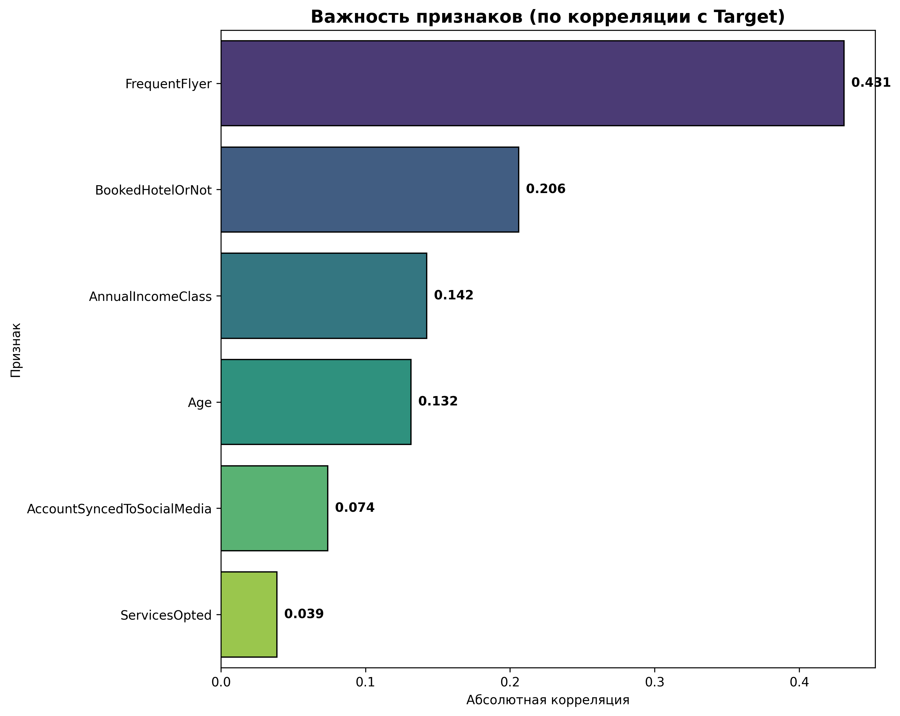
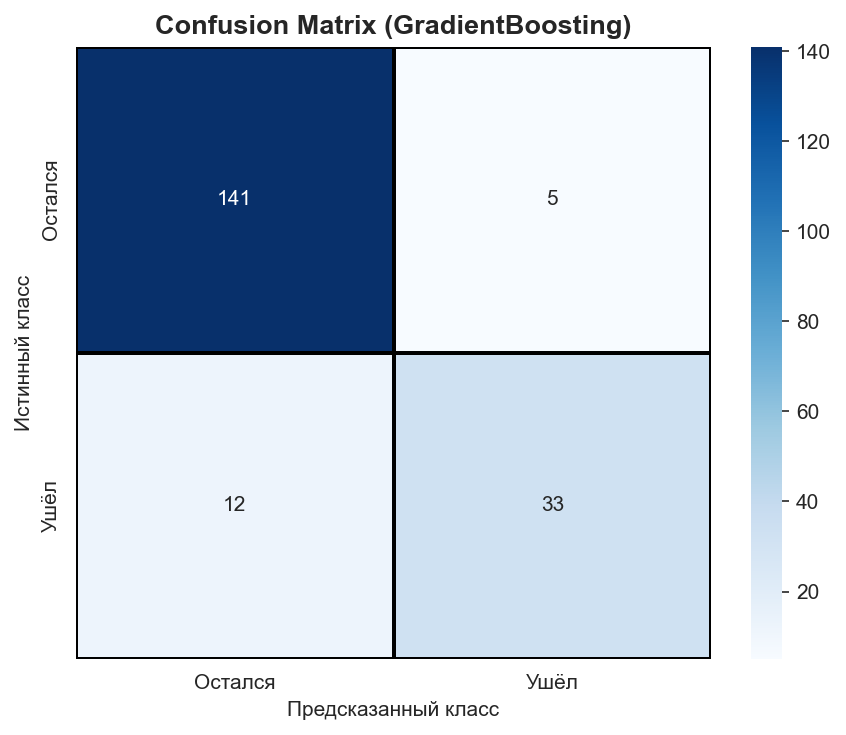
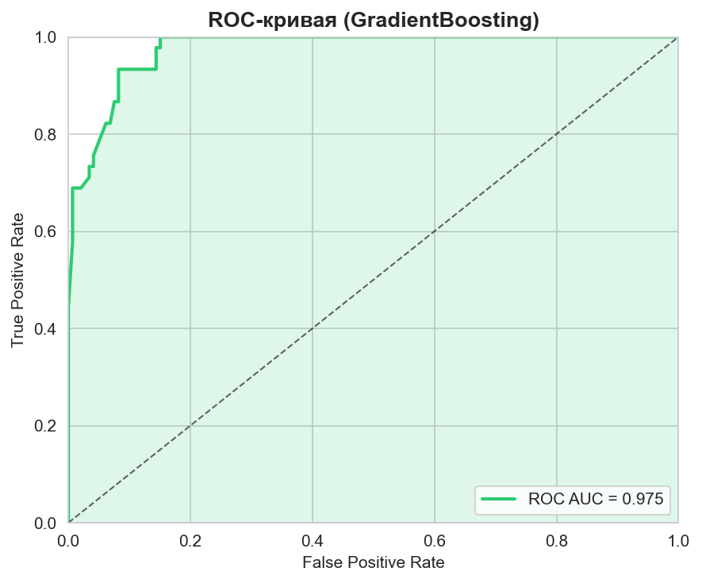
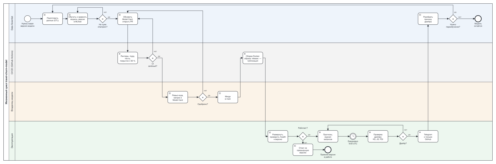

# Отчёт по учебному проекту

**Студент:** Калинина Виктория Андреевна

**Название задания:** Итоговый проект по дисциплине Автоматизация машинного обучения

**GitHub-репозиторий:** [https://github.com/vikalinet/travel-churn-prediction](https://github.com/vikalinet/travel-churn-prediction)

**Презентация проекта:** [Смотреть презентацию](presentation.html) (включая все метрики качества: Accuracy, Precision, Recall, F1-Score, ROC AUC)

**Отчёты и визуализации:** [reports/](reports/)

---

## Содержание

1. [Описание проекта](#1-описание-проекта)
2. [AutoML и кастомная модель](#2-automl-и-кастомная-модель)
3. [Тестирование](#3-тестирование)
4. [Создание контейнера для пайплайна (Docker)](#4-создание-контейнера-для-пайплайна-docker)
5. [CI/CD](#5-cicd)
   - 5.3 [Качество кода: окружение, линтеры, pre-commit](#53-качество-кода-окружение-линтеры-pre-commit)
6. [Мониторинг](#6-мониторинг)
   - 6.1 [Мониторинг качества модели](#61-мониторинг-качества-модели)
   - 6.2 [Мониторинг инфраструктуры](#62-мониторинг-инфраструктуры)
   - 6.3 [Мониторинг дрейфа данных — автоматизация](#63-мониторинг-дрейфа-данных--автоматизация)
   - 6.4 [Автоматический мониторинг дрейфа (GitHub Actions)](#64-автоматический-мониторинг-дрейфа-github-actions)
   - 6.5 [Model Card и жизненный цикл модели](#65-model-card-и-жизненный-цикл-модели)
7. [GitHub-репозиторий](#7-github-репозиторий)
8. [Презентация](#8-презентация)
9. [Быстрый старт](#9-быстрый-старт)

---

## 1. Описание проекта

### 1.1 Бизнес-задача

Туристическое агентство сталкивается с оттоком клиентов. Без системы раннего предупреждения компания тратит ресурсы на массовые кампании удержания, которые неэффективны и раздражают лояльных клиентов.

**Ключевой вопрос:** Как предсказать, какие клиенты собираются уйти, чтобы предложить им персонализированные скидки и программы лояльности?

**Целевая метрика:** Увеличение удержания клиентов на 15–20% за счёт своевременного выявления групп риска.

**Ожидаемый эффект (гипотеза для пилотного внедрения):**
- Сокращение расходов на удержание на 30% (таргетированное удержание вместо массового)
- Рост повторных продаж на 15%
- Повышение удовлетворённости клиентов

### 1.2 Схема пайплайна

```
┌─────────────┐     ┌──────────────┐     ┌──────────────┐     ┌─────────────┐
│   Данные    │────>│    ETL       │────>│   Обучение   │────>│   MLflow    │
│   (CSV)     │     │  (pandas)    │     │   моделей    │     │  (реестр)   │
└─────────────┘     └──────────────┘     └──────────────┘     └─────────────┘
                                                                   │
                                                                   v
┌─────────────┐     ┌──────────────┐     ┌──────────────┐     ┌─────────────┐
│  Мониторинг │<────│  Evidently   │<────│  FastAPI     │<────│  Предсказание│
│  (дрейф)    │     │   AI         │     │  сервис      │     │   (Docker)  │
└─────────────┘     └──────────────┘     └──────────────┘     └─────────────┘
```

### 1.3 Элементы ETL (Extract, Transform, Load)

**Источник данных:** датасет Customer Travel Churn (954 клиента, 7 признаков), файл `data/raw/Customertravel.csv`.

**Extract (Извлечение):**
- Загрузка CSV-файла через `pandas.read_csv()`
- Проверка целостности и структуры данных

**Transform (Трансформация):**
1. Очистка данных: обработка пропущенных значений (медиана для числовых, мода для категориальных)
2. Кодирование категориальных признаков через `LabelEncoder`:
   - Yes/No → 0/1
   - AnnualIncomeClass: Low/Middle/High → 0/1/2
3. Генерация новых признаков: `travel_frequency_score`
4. Проверка типов данных и диапазонов значений

**Load (Загрузка):**
- Сохранение обработанных данных в `data/processed/processed_data.csv`
- Экспорт обученной модели в `models/best_model.pkl`
- Логирование экспериментов в MLflow

### 1.4 Архитектура ML-модели

Обучено и сравнено **14 вариантов моделей** классификации: 13 кастомных (базовые, подобранные Optuna и улучшенные) и AutoGluon AutoML:

| Модель | Accuracy | F1-score | ROC AUC | Precision | Recall | Порог |
|--------|----------|----------|---------|-----------|--------|-------|
| **GradientBoosting_Balanced** 🏆 | **91.6%** | **81.8%** | 96.1% | 83.7% | **80.0%** | 0.41 |
| **Stacking** | 90.1% | 81.6% | **96.9%** | 72.4% | **93.3%** | 0.31 |
| RandomForest_Balanced | 90.6% | 81.3% | 96.6% | 76.5% | 86.7% | 0.42 |
| XGBoost_Balanced | 91.1% | 80.9% | 96.9% | 81.8% | 80.0% | 0.64 |
| LogisticRegression_Balanced | 85.3% | 70.8% | 88.9% | 66.7% | 75.6% | 0.54 |
| GradientBoosting (базовая) | 91.1% | 79.5% | 97.5% | 86.8% | 73.3% | 0.50 |
| XGBoost (Tuned, Optuna) | 90.1% | 77.1% | 96.7% | 84.2% | 71.1% | 0.50 |
| RandomForest | 89.5% | 76.2% | 95.7% | 82.1% | 71.1% | 0.50 |
| XGBoost | 89.5% | 76.2% | 97.0% | 82.1% | 71.1% | 0.50 |
| KNeighbors | 89.5% | 75.6% | 94.8% | 83.8% | 68.9% | 0.50 |
| RandomForest (Tuned, Optuna) | 88.5% | 73.2% | 96.0% | 81.1% | 66.7% | 0.50 |
| AutoGluon AutoML | 89.5% | 76.2% | 96.8% | 82.1% | 71.1% | — |
| LogisticRegression | 83.2% | 54.3% | 84.7% | 76.0% | 42.2% | 0.50 |
| SVC | 76.4% | 0.0% | 85.7% | 0.0% | 0.0% | 0.50 |

**Лучшая модель:** GradientBoosting_Balanced — F1-score 81.8%, ROC AUC 96.1%; её использует API. Улучшения (веса классов, подбор порога, признаки) подняли полноту и F1 по сравнению с базовой GradientBoosting (F1 79.5%, ROC AUC 97.5%) ценой небольшого снижения ROC AUC.

**Признаки модели:**
- `Age` — возраст клиента
- `FrequentFlyer` — частота перелётов (Yes/No)
- `AnnualIncomeClass` — класс дохода (Low/Middle/High)
- `ServicesOpted` — количество выбранных услуг (1–6)
- `AccountSyncedToSocialMedia` — синхронизация с соцсетями
- `BookedHotelOrNot` — бронирование отеля

**Целевая переменная:** `Target` (Churn: 0 — остался, 1 — ушёл)

### 1.5 Полученные метрики модели

**Улучшенная модель** (GradientBoosting_Balanced с threshold tuning и feature engineering):

| Метрика | Значение | Интерпретация |
|---------|----------|---------------|
| **Accuracy** | **91.6%** | Общая точность предсказаний |
| **Precision** | **83.7%** | Из всех "отток=1" предсказаний, 83.7% верны |
| **Recall** | **80.0%** | Из всех реально ушедших, модель нашла 80.0% |
| **F1-score** | **81.8%** | Сбалансированная метрика (рост +2.3%) |
| **ROC AUC** | **96.1%** | Отличное разделение классов |
| **Порог** | **0.41** | Оптимальный порог классификации (вместо 0.5) |

**Улучшения по сравнению с базовой моделью:**
- Recall: 73.3% → **80.0%** (+6.7pp) — находим больше уходящих клиентов
- F1-score: 79.5% → **81.8%** (+2.3pp) — лучший баланс точности и полноты
- Accuracy: 91.1% → **91.6%** (+0.5pp)

**Техники улучшения:**
1. **Class weights** — учёт дисбаланса классов (отток — 23,5 % клиентов)
2. **Threshold tuning** — оптимальный порог 0.41 вместо фиксированного 0.5
3. **Feature engineering** — полиномиальные признаки и взаимодействия (6 → 45 признаков)
4. **Stacking ensemble** — мета-модель объединяет 4 алгоритма (Recall 93.3%)

### 1.6 Визуализации, графики, изображения

Проект содержит следующие визуализации в папке `reports/`:

- `reports/training_report.html` — HTML-отчёт с метриками и временем обучения
- `reports/training_results.csv` — таблица метрик всех моделей (подтверждено актуальными данными)
- `reports/model_comparison_full.csv` — полное сравнение моделей
- `reports/index.html` — индексная страница отчётов

**Ключевые графики:**


*Рис. 1 — Важность признаков (по корреляции с целевой переменной). Наибольший вклад вносит `ServicesOpted` и `BookedHotelOrNot`.*

 
*Рис. 2 — Confusion Matrix и ROC-кривая базовой модели GradientBoosting (до улучшений). ROC AUC = 0.975.*

> Графики пересобираются скриптом: `poetry run python scripts/generate_readme_charts.py`

В папке `scripts/visualizations/` реализованы скрипты генерации:
- `model_comparison.py` — сравнение моделей по метрикам
- `data_distribution.py` — распределение данных
- `feature_importance.py` — важность признаков
- `churn_analysis.py` — анализ оттока

Отчёты публикуются на GitHub Pages: [https://vikalinet.github.io/travel-churn-prediction/reports/](https://vikalinet.github.io/travel-churn-prediction/reports/)

---

## 2. AutoML и кастомная модель

### 2.1 Описание используемой модели AutoML

В проекте реализован **AutoML фреймворк AutoGluon** (`src/training/automl_training.py`):
- Используется `TabularPredictor` из `autogluon.tabular`
- Автоматический подбор моделей и гиперпараметров в заданный time limit (180 сек)
- Поддержка presets: `medium_quality`, `good_quality`, `best_quality`
- Генерация лидерборда сравнения моделей
- Сохранение лучшей модели в `autogluon_models/`

**Результаты AutoGluon (фактические измерения):**
- Accuracy: 89.5%, F1-score: 76.2%, ROC AUC: 96.8%
- Лучшая модель в лидерборде — ансамбль LightGBM/XGBoost

### 2.2 Описание автоматизации отдельных элементов пайплайна

**Автоматизация обучения (кастомная модель):**
- `ImprovedModelTrainer.run_improved_pipeline()` — единый метод: загрузка → feature engineering → обучение с class weights → threshold tuning → stacking ensemble → сравнение → сохранение
- `Optuna` — байесовская оптимизация гиперпараметров для XGBoost и RandomForest (30 trials, TPE-сэмплер)
- MLflow — улучшенный пайплайн записывает по прогону на каждую модель: метрики, порог, параметры обучения; лучшая — с тегом `best=true` и сохранённой моделью

**Автоматизация отчётов:**
- `scripts/generate_all_visualizations.py` — генерация всех графиков
- `scripts/generate_training_report.py` — HTML-отчёт с метриками
- `scripts/generate_drift_report.py` — HTML/JSON-отчёт о дрейфе (KS-тест, JS-расхождение, PSI)
- `reports/index.html` — индексная страница отчётов (статическая)

**Интеграция AutoML в пайплайн:**
- Метод `train_automl()` встроен в общий пайплайн обучения
- Сравнение AutoML с кастомными моделями по метрикам
- Автоматическая визуализация результатов

---

## 3. Тестирование

### 3.1 Используемые инструменты

- **pytest** — фреймворк для тестирования
- **pytest-cov** — измерение покрытия кода
- **FastAPI TestClient** — интеграционное тестирование API
- **unittest.mock** — мокирование зависимостей

### 3.2 Структура тестов

**Unit-тесты (`tests/test_preprocessing.py`):**
- `TestDataExtractor` — загрузка CSV, обработка отсутствующих файлов (`FileNotFoundError`)
- `TestDataTransformer` — обработка пропусков (медиана/мода), создание признаков, кодирование категорий
- `TestModelPrediction` — формат предсказаний (0/1), формат вероятностей (shape `(n, 2)`, значения в [0, 1]) через моки
- `TestDataValidation` — наличие обязательных колонок, корректность типов данных, допустимый процент пропусков (< 50%)
- `TestDataTransformerAdvanced` — обработка выбросов методом IQR, масштабирование `StandardScaler`, полный пайплайн трансформации

**Интеграционные тесты (`tests/test_integration.py`):**
- `TestFullPipeline` — ETL: загрузка → обработка → сохранение; обучение модели; end-to-end предсказание для нового клиента
- `TestAPIIntegration` — `GET /api/v1/health`, `GET /`, `POST /api/v1/predict`, `POST /api/v1/predict_batch` через FastAPI `TestClient`
- `TestModelPersistence` — сериализация/десериализация через `joblib`, идентичность предсказаний
- `TestMLflowIntegration` — логирование метрик и моделей в MLflow (SQLite backend)
- `TestSystemMonitor` — формат системных метрик (timestamp, platform, python_version)
- `TestAPIEdgeCases` — предсказание при отсутствии модели (HTTP 500, сообщение "Модель не загружена")
- `TestMonitoringDashboard`, `TestDriftDashboard` — страницы мониторинга и дрейфа

**Мониторинг и отчёты:**
- `tests/test_settings.py` — запуск приложения не меняет файлы в git; пути не зависят от папки запуска
- `tests/test_monitoring.py` — отчёты Evidently действительно строятся; отчёт без текущих данных; HTML-страницы дрейфа и мониторинга
- `tests/test_drift_stats.py` — общий расчёт дрейфа для числовых и категориальных признаков
- `tests/test_system_monitor.py`, `tests/test_report_scripts.py` — страницы отчётов, собранные из шаблонов

**Обучение (`tests/test_training.py`):** базовые модели, улучшенный пайплайн (пакет модели с порогом и 45 признаками), подбор гиперпараметров Optuna, сравнение моделей, логирование в MLflow — на выборке из 300 клиентов реальных данных; всё, что пишет обучение, уходит во временную папку

Все тесты пишут во временную папку (`tests/conftest.py`), а не в репозиторий.

### 3.3 Покрытие кода и запуск

| Метрика | Значение |
|---------|----------|
| Библиотека | pytest + pytest-cov |
| Измеряется | `src/` (все модули) |
| Покрытие | 67 % (95 тестов; замер 05.10.2026) |
| Отчёт | HTML + XML; в CI — артефакт сборки `coverage-report` |
| Порог в CI | 60 % — ниже сборка падает |
| CI/CD | Автозапуск при push |

**Запуск тестов:**
```bash
poetry run pytest                         # настройки — в pyproject.toml, с покрытием
```

---

## 4. Создание контейнера для пайплайна (Docker)

### 4.1 Dockerfile

Проект использует **multi-stage build** Dockerfile для оптимизации размера образа:

| Команда | Функция |
|---------|---------|
| `FROM python:3.13-slim AS builder` | Этап сборки: установка системных зависимостей (gcc, g++, make) и Python-пакетов |
| `FROM python:3.13-slim AS production` | Финальный этап: только код приложения и установленные пакеты |
| `COPY --from=builder /usr/local/lib/python3.13/site-packages` | Копирование зависимостей из builder (экономия ~300–500 МБ) |
| `RUN useradd -m -u 1000 appuser` | Создание непривилегированного пользователя |
| `USER appuser` | Запуск от нерута пользователя (безопасность) |
| `HEALTHCHECK` | Проверка здоровья сервиса каждые 30 секунд |
| `EXPOSE 8000` | Порт FastAPI |
| `CMD ["uvicorn", ...]` | Запуск веб-сервера |

**Оптимизации:**
- `--no-cache-dir` в pip — уменьшение размера образа
- `slim` версия Python — минимизация уязвимостей
- **Multi-stage build** — финальный образ не содержит инструментов сборки (gcc, g++), только runtime

### 4.2 Docker Compose

Файл `docker-compose.yml` описывает два сервиса:

| Сервис | Образ | Порт | CPU | Память |
|--------|-------|------|-----|--------|
| web | Собирается из Dockerfile | 8000 | 0.5–1 | 1–2 ГБ |
| mlflow | `ghcr.io/mlflow/mlflow:v3.13.0` (та же версия, что клиент) | 5000 | 0.5–1 | 1–2 ГБ |

**Запуск:**
```bash
docker compose up --build
```

Приложение читает эксперименты из своей копии `mlflow.db` в образе; сервер
MLflow при старте копирует ту же базу к себе, поэтому интерфейс MLflow
(порт 5000) показывает те же эксперименты и не меняет файл в репозитории.

### 4.3 Функции контейнеризации

| Аспект | Реализация |
|--------|------------|
| **Безопасность** | Запуск от непривилегированного пользователя (`appuser`, uid 1000) |
| **Изоляция** | Отдельные контейнеры для API и MLflow |
| **Ресурсы** | Лимиты CPU и памяти через `deploy.resources` |
| **Хранение данных** | Persistent volume `mlflow_data` для MLflow |
| **Сеть** | Внутренняя сеть Docker, проброс портов на хост |
| **Зависимости** | `depends_on` для порядка запуска сервисов |
| **Health Check** | Автоматическая проверка доступности сервисов |
| **Масштабирование** | Легкое развёртывание на новых серверах |

---

## 5. CI/CD

### 5.1 GitHub Actions — пайплайны

Реализовано **три workflow** в папке `.github/workflows/`:

**Пайплайн 1: `ci-cd.yml` — Тесты, сборка Docker, публикация**

| Шаг | Описание | Инструмент |
|-----|----------|------------|
| 1. Checkout | Клонирование репозитория | `actions/checkout@v4` |
| 2. Setup Python | Python 3.13, кеш зависимостей по хешу `poetry.lock` | `actions/setup-python@v5` |
| 3. Install deps | Окружение из lock-файла — те же версии, что у разработчика | `poetry install` |
| 4. Linting | Проверка кода; сборка падает на любом замечании | `flake8` |
| 5. Format check | Проверка форматирования | `black --check` |
| 6. Type check | Проверка типов; сборка падает на ошибке | `mypy` |
| 7. Tests | Запуск тестов | `pytest` с покрытием |
| 8. Coverage | Отчёт о покрытии — артефакт сборки (порог 60 %) | `actions/upload-artifact@v4` |
| 9. Docker build | Сборка образа | `docker/build-push-action@v5` |
| 10. Docker push | Публикация в Docker Hub | при коммите с префиксом `release:` |

**Условия запуска:**
- push в `main`/`develop` и Pull Request в `main`
- Docker собирается только при `push` в `main`
- Job `docker-build` зависит от `lint-and-test` (неудачные тесты блокируют сборку)
- Push в Docker Hub выполняется только при коммите с префиксом `release:` (например, `release: v1.2.0`)

> **⚠️ Важно:** Для публикации образа в Docker Hub необходимо задать секреты в настройках репозитория GitHub → `Settings → Secrets and variables → Actions`:
> - `DOCKER_USERNAME` — логин Docker Hub
> - `DOCKER_PASSWORD` — пароль или Personal Access Token

**Пайплайн 2: `pages.yml` — GitHub Pages**

Публикует файлы репозитория как есть (`actions/upload-pages-artifact` →
`actions/deploy-pages`). Отчёты при этом не пересобираются: их пересобирают
вручную скриптами и коммитят.

| Отчёт | Как пересобрать |
|-------|-----------------|
| Графики | `poetry run python scripts/generate_all_visualizations.py` |
| Отчёт об обучении | `poetry run python scripts/generate_training_report.py` |
| Отчёт о дрейфе (образец) | `poetry run python scripts/generate_drift_report.py` |
| README.html | `poetry run python scripts/generate_readme_html.py` |

Разметка всех отчётов — в шаблонах `templates/reports/`.

**Результат:** [https://vikalinet.github.io/travel-churn-prediction/reports/](https://vikalinet.github.io/travel-churn-prediction/reports/)

**Пайплайн 3: `drift-monitoring.yml` — Автоматический мониторинг дрейфа**

| Шаг | Описание |
|---|---|
| Расписание | `cron: '0 9 * * *'` (ежедневно в 9:00 UTC) |
| Анализ | Задан `APP_URL` — `POST /api/v1/drift/analyze` на развёрнутом приложении (по реальным запросам); не задан — тот же расчёт в CI по данным репозитория |
| Итог | Сводка (признаки с дрейфом, макс. PSI) в отчёте о запуске |
| Алертинг | Telegram при `drift_count > 0`; задание падает — GitHub присылает письмо |
| Артефакт | JSON-сводка (и HTML-отчёт в режиме CI) хранится 30 дней |

### 5.2 Список используемых git-команд

```bash
# 1. Инициализация репозитория (первый запуск)
git init
git branch -M main
git remote add origin https://github.com/vikalinet/travel-churn-prediction.git

# 2. Добавление файлов в индекс
git add .                              # Все файлы
git add src/api/main.py               # Конкретный файл
git add -A                             # Все изменения (включая удалённые)

# 3. Коммит с описанием (Conventional Commits)
git commit -m "feat: добавлена визуализация моделей"
git commit -m "fix: исправлена ошибка в API"
git commit -m "docs: обновлён README"
git commit -m "test: добавлены unit-тесты"
git commit -m "release: v1.0.0 — финальная версия"

# 4. Отправка в удалённый репозиторий
git push -u origin main                # Первый пуш с установкой upstream
git push                               # Последующие push

# 5. Получение изменений с удалённого репозитория
git pull origin main

# 6. Работа с ветками
git checkout -b feature/new-model      # Создание и переход в ветку
git checkout main                      # Переход в main
git branch -a                          # Показать все ветки

# 7. Слияние веток
git checkout main
git merge feature/new-model            # Слияние с main
git branch -d feature/new-model        # Удаление локальной ветки
git push origin main                   # Пуш слияния

# 8. Откат изменений (при необходимости)
git reset --hard HEAD~1                # Откат последнего коммита
git revert <commit-hash>               # Создание коммита-отмены

# 9. Работа с тегами (версионирование)
git tag -a v1.0.0 -m "Release v1.0.0"
git push origin --tags

# 10. Просмотр истории
git log --oneline                      # Краткая история
git log --graph --oneline --all        # Графическая история
git diff HEAD~1 HEAD                   # Разница между коммитами
git status                             # Статус рабочей директории
```

**Локальный цикл разработки:**
```
1. git pull origin main           # Синхронизация с удалённой версией
2. git checkout -b feature/xxx    # Создание ветки для задачи
3. ... кодирование ...
4. git add . && git commit -m "..."
5. poetry run pytest              # Локальный запуск тестов (pre-commit проверит код при коммите)
6. git push -u origin feature/xxx # Пуш ветки → CI проверяет Pull Request
7. Pull Request в main на GitHub, слияние после зелёного CI
8. git checkout main && git pull  # Синхронизация после слияния
```

---

### 5.3 Качество кода: окружение, линтеры, pre-commit

**Окружение.** Poetry: зависимости в `pyproject.toml`, точные версии — в
`poetry.lock`, окружение `.venv` создаётся в папке проекта и в git не
хранится. Одна версия Python (3.13) — локально, в CI и в Docker.
Подробнее — раздел 9.

**Проверки кода** — одни и те же в pre-commit, в CI и при ручном запуске:

| Инструмент | Что проверяет | Настройки |
|------------|---------------|-----------|
| black | Форматирование (длина строки 88) | `pyproject.toml` |
| flake8 | Стиль PEP 8, ошибки (pyflakes), сложность функций (McCabe ≤ 10) | `.flake8` |
| mypy | Типы в `src/` | `pyproject.toml` |
| pre-commit-hooks | Пробелы, конец файла, YAML/TOML, следы конфликтов, закрытые ключи, файлы > 1 МБ | `.pre-commit-config.yaml` |
| poetry check / export | `poetry.lock` соответствует `pyproject.toml`, `requirements.txt` выгружен из `poetry.lock` | `.pre-commit-config.yaml` |

```bash
poetry run pre-commit install              # один раз: проверки перед каждым коммитом
poetry run pre-commit run --all-files      # прогон по всему проекту
```

Хук mypy запускается через `poetry run`, поэтому команда `poetry` должна быть
доступна в терминале, из которого делается коммит.

---

## 6. Мониторинг

### 6.1 Мониторинг качества модели

**MLflow — Версионирование и логирование:**
- Каждый запуск улучшенного пайплайна (`python -m src.training.improved_training`)
  создаёт в эксперименте «Travel Churn Prediction» по прогону на модель
- В прогоне: метрики (Accuracy, Precision, Recall, F1-Score, ROC AUC), порог
  классификации, число признаков и размеры выборок
- Лучшая модель помечена тегом `best=true`, сохранена в MLflow и **зарегистрирована
  новой версией** модели `travel-churn-model` в реестре MLflow (Model Registry);
  alias `champion` указывает на версию, которую использует API
- Метрики и параметры хранятся в `mlflow.db` (в git); файлы моделей MLflow — в
  `mlruns/` (в git не хранятся, видны в интерфейсе MLflow на машине, где шло обучение)
- Сравнение прогонов — в интерфейсе MLflow (порт 5000) и на странице `/monitoring`

**Локальный запуск MLflow:**
```bash
poetry run mlflow ui --backend-store-uri sqlite:///mlflow.db --port 5000
```

**Мониторинг дрейфа данных:**
- Цель: обнаружение data drift — изменения распределения признаков во времени
- Метод: KS-тест (Kolmogorov-Smirnov) для числовых признаков и JS-расхождение для
  категориальных (scipy, `src/monitoring/drift_stats.py`) — его использует API
- Порог значимости: p-value < 0.05 → дрейф обнаружен
- **PSI (Population Stability Index)** — для всех признаков: `Σ (cur − ref) · ln(cur / ref)`
  по значениям признака (≤ 10 значений) или по 10 квантильным интервалам эталона.
  Шкала: < 0.1 — стабильно, 0.1–0.25 — умеренный сдвиг, > 0.25 — значимый сдвиг → дрейф
  (даже если статистический тест его не показал)
- Подробные HTML-отчёты строит **Evidently AI** (`src/monitoring/drift_monitor.py`)

**Результаты анализа (пересчитано 05.10.2026 — совпадают с анализом 31.05.2026):**

| Признак | Статус | KS-статистика | p-value | PSI | Интерпретация |
|---------|--------|---------------|---------|-----|---------------|
| Age | ✅ OK | 0.0361 | 0.9834 | 0.0295 | Распределение стабильно |
| FrequentFlyer | ✅ OK | 0.0148 | 1.0000 | 0.0011 | Распределение стабильно |
| AnnualIncomeClass | ✅ OK | 0.0149 | 1.0000 | 0.0017 | Распределение стабильно |
| ServicesOpted | ✅ OK | 0.0237 | 1.0000 | 0.0146 | Распределение стабильно |
| AccountSyncedToSocialMedia | ✅ OK | 0.0332 | 0.9935 | 0.0048 | Распределение стабильно |
| BookedHotelOrNot | ✅ OK | 0.0479 | 0.8535 | 0.0095 | Распределение стабильно |

Максимальный PSI — 0.0295 (Age), значительно ниже порога 0.1.

**Вывод:** Дрейф **не обнаружен**. Данные стабильны, модель актуальна.

**Отчёты:**
- HTML отчёт: `evidently_reports/drift_report.html`
- JSON сводка: `evidently_reports/drift_summary.json`
- Онлайн: [GitHub Pages](https://vikalinet.github.io/travel-churn-prediction/reports/)

**Алертинг при дрейфе:**
- При обнаружении дрейфа (`p-value < 0.05` или `PSI > 0.25`) автоматически создаётся файл `drift_alert.json` в папке выполнения `runtime/evidently_reports/`
- Поддержка уведомлений в **Telegram** через переменные окружения `TELEGRAM_BOT_TOKEN` и `TELEGRAM_CHAT_ID`
- Telegram-уведомление отправляет `_analyze_drift()` (API); `check_drift_threshold()` монитора дрейфа пишет `drift_alert.json` и вызывает веб-хук `DRIFT_WEBHOOK_URL`, если он задан

**Пересборка образца отчёта в репозитории:**
```bash
poetry run python scripts/generate_drift_report.py
```

Расчёт дрейфа у скрипта и у API общий — `src/monitoring/drift_stats.py`.

### 6.2 Мониторинг инфраструктуры

**Docker — ограничение ресурсов:**

| Сервис | CPU (min–max) | Память (min–max) |
|--------|---------------|------------------|
| web (FastAPI) | 0.5 – 1 ядро | 1 – 2 ГБ |
| mlflow | 0.5 – 1 ядро | 1 – 2 ГБ |

**Просмотр использования ресурсов:**
```bash
docker stats
```

**Производительность API:**
- Время ответа `POST /api/v1/predict`: медиана ~8 мс, 95 % запросов быстрее 16 мс
  (замер 05.10.2026, 50 запросов, без учёта сети)
- Пакетные предсказания: любое число клиентов в одном запросе
- Асинхронная обработка запросов (uvicorn)

**Версионирование моделей:**
- Реестр MLflow: каждое обучение регистрирует лучшую модель новой версией
  `travel-churn-model` (v1, v2, …) и переносит на неё alias `champion`; прежние версии
  остаются в реестре вместе с прогоном, метриками и параметрами
- Номер версии, id прогона MLflow и время обучения записываются в
  `models/best_model_improved.pkl`; API отдаёт их в `GET /api/v1/models`
  (`model_version`, `mlflow_run_id`, `trained_at`) и пишет в лог при старте
- Файл модели хранится в git — откат к прежней версии через историю git; версия в
  файле показывает, какой записи реестра он соответствует
- Все версии и alias видны на странице `/monitoring` (блок Model Registry) и во
  вкладке Models интерфейса MLflow

**Логирование и аудит:**
```bash
docker compose logs -f        # Логи всех сервисов
docker compose logs -f web    # Логи конкретного сервиса
```

**CI/CD мониторинг:**
- Время пайплайна: ~2 минуты (проверки и тесты ~1 мин, сборка Docker-образа ~1 мин)
- Покрытие кода тестами: 67 % (см. раздел 3.3)
- При push в `main`: сборка Docker-образа и публикация GitHub Pages

### 6.3 Мониторинг дрейфа данных — автоматизация

**Страница:** `GET /drift` — интерактивный дашборд дрейфа (развёрнут на том же сервере).

**Как это работает:**
1. При старте приложения автоматически запускается анализ дрейфа (`_analyze_drift()` в lifespan).
   Что с чем сравнивается:
   - каждый клиент из `/predict` и `/predict_batch` записывается в журнал
     `runtime/monitoring/current_data.csv` (`src/monitoring/prediction_log.py`) в том же
     кодировании, что обучающие данные;
   - набралось ≥ 50 запросов — анализ сравнивает их со всей обучающей выборкой
     (дрейф на реальных данных);
   - пока запросов меньше — сравниваются части датасета (train против test).
   Режим указан на дашборде и в сводке (`source`).
2. Результаты сохраняются в `runtime/evidently_reports/drift_summary.json` — в папку выполнения вне git (`CHURN_RUNTIME_DIR`); файлы `evidently_reports/` в репозитории — образцы только для чтения, их дашборд показывает, пока анализ не запускался.
3. Дашборд `/drift` читает этот JSON и отображает:
   - Сводку: сколько признаков с дрейфом, максимальный PSI
   - График p-value / JS-divergence (inline SVG)
   - Таблицу со статистиками и PSI по каждому признаку
   - Цветовую индикацию: 🟢 OK / 🔴 ДРЕЙФ

**Ручной пересчёт:**
```bash
curl -X POST http://localhost:8000/api/v1/drift/analyze
```
Или нажать кнопку **«Обновить анализ»** прямо на странице `/drift`.

**Проверка на имитации запросов** (приложение запущено, например, на порту 8000):
```bash
poetry run python scripts/simulate_traffic.py            # 60 обычных клиентов → дрейфа нет
poetry run python scripts/simulate_traffic.py --shift    # клиенты старше и без FrequentFlyer → дрейф по Age и FrequentFlyer
```
Скрипт отправляет клиентов в `/api/v1/predict_batch`, запускает анализ и печатает PSI по
признакам; результат виден и на `/drift`. Журнал копится — чтобы начать заново, удалите
`runtime/monitoring/current_data.csv` (в Docker он лежит в томе `churn_runtime` и переживает
пересоздание контейнера).

**JSON API:**
- `GET /api/v1/drift/status` — текущий статус дрейфа
- `POST /api/v1/drift/analyze` — запуск нового анализа

**Интерпретация:**
- **KS-тест** (числовые признаки): `p-value < 0.05` → распределения различаются → дрейф.
- **JS-divergence** (категориальные): значение `> 0.2` → значимое изменение.
- **PSI** (все признаки): `< 0.1` стабильно, `0.1–0.25` умеренный сдвиг, `> 0.25` → дрейф.
- При обнаружении дрейфа рекомендуется переобучить модель.

### 6.4 Автоматический мониторинг дрейфа (GitHub Actions)

Workflow `.github/workflows/drift-monitoring.yml` запускается **ежедневно в 9:00 UTC** (12:00 по Москве):

| Шаг | Описание |
|---|---|
| 1. Анализ | Задан `APP_URL` — `POST /api/v1/drift/analyze` и `GET /api/v1/drift/status` на развёрнутом приложении (дрейф по реальным запросам). Не задан — `scripts/generate_drift_report.py --output-dir drift-reports` прямо в CI |
| 2. Итог | Число признаков с дрейфом, макс. PSI и режим сравнения — в сводке запуска (Summary) |
| 3. Алерт | Если `drift_count > 0` → уведомление в Telegram и запуск завершается с ошибкой (письмо от GitHub) |
| 4. Артефакт | `drift-reports/` (JSON, в режиме CI ещё HTML-отчёт) — в артефакты GitHub Actions на 30 дней |

**Настройка секретов** (GitHub → Settings → Secrets and variables → Actions):

| Секрет | Описание | Обязательный |
|---|---|---|
| `APP_URL` | Адрес развёрнутого приложения. Не задан — анализ выполняется в CI по данным репозитория | ❌ |
| `TELEGRAM_BOT_TOKEN` | Токен бота от @BotFather | ❌ |
| `TELEGRAM_CHAT_ID` | ID чата (узнать через @userinfobot) | ❌ |

**Как настроить Telegram-бота:**
1. Напишите @BotFather → `/newbot` → получите токен (`TELEGRAM_BOT_TOKEN`)
2. Напишите боту любое сообщение
3. Откройте `https://api.telegram.org/bot<TOKEN>/getUpdates` и найдите `"chat":{"id":123456789}`
4. Добавьте оба значения в Secrets GitHub

**Ручной запуск:**
```bash
# Через GitHub UI: Actions → Daily Drift Monitoring → Run workflow
```

**Что происходит при обнаружении дрейфа:**
1. Запуск завершается с ошибкой — GitHub присылает письмо, итог виден в Summary
2. Бот отправляет сообщение в Telegram: «⚠️ Data Drift Alert — обнаружен дрейф в N признаках»
3. Отчёт сохраняется в артефакты с retention 30 дней
4. На странице `/drift` отображается красный баннер при следующем открытии

**Контроль качества данных** (тесты `TestDataValidation`):
- Проверка наличия обязательных колонок
- Проверка типов данных (числовые, категориальные)
- Проверка отсутствия критических пропусков (< 50%)

### 6.5 Model Card и жизненный цикл модели

- **[Model Card](docs/MODEL_CARD.md)** — документация модели: назначение и границы
  применения, данные, метрики (в том числе осторожная оценка кросс-валидацией без
  повторов в данных), качество по группам клиентов, этические соображения,
  ограничения, мониторинг и история версий.
- **[Жизненный цикл модели (BPMN)](docs/MODEL_LIFECYCLE.md)** — процесс от обучения
  до эксплуатации с согласованием: участники, шаги, критерии на шлюзах, откат,
  возврат к переобучению по дрейфу. Схема — [`docs/model_lifecycle.svg`](docs/model_lifecycle.svg),
  файл BPMN 2.0 — [`docs/model_lifecycle.bpmn`](docs/model_lifecycle.bpmn)
  (открывается в [demo.bpmn.io](https://demo.bpmn.io) и Camunda Modeler).



---

## 7. GitHub-репозиторий

**Ссылка на репозиторий:** [https://github.com/vikalinet/travel-churn-prediction](https://github.com/vikalinet/travel-churn-prediction)

**Структура репозитория:**

```
travel-churn-prediction/
├── .github/
│   └── workflows/           # CI/CD пайплайны
│       ├── ci-cd.yml
│       ├── drift-monitoring.yml
│       └── pages.yml
├── data/
│   ├── raw/                 # Сырые данные (Customertravel.csv)
│   └── processed/           # Обработанные данные (processed_data.csv)
├── docs/                    # Model Card и BPMN-процесс жизненного цикла модели
│   ├── MODEL_CARD.md
│   ├── MODEL_LIFECYCLE.md
│   ├── model_lifecycle.bpmn
│   └── model_lifecycle.svg
├── evidently_reports/       # Образцы отчётов о дрейфе (только чтение)
│   ├── drift_report.html
│   └── drift_summary.json
├── models/                  # Сохранённые модели
│   ├── best_model_improved.pkl  # Используется API (GradientBoosting_Balanced)
│   └── best_model.pkl
├── reports/                 # Визуализации и HTML-отчёты
│   ├── index.html
│   ├── training_report.html
│   ├── training_results.csv
│   └── model_comparison_full.csv
├── scripts/                 # Скрипты генерации отчётов
│   ├── generate_all_visualizations.py
│   ├── generate_bpmn.py
│   ├── generate_drift_report.py
│   ├── generate_readme_charts.py
│   ├── generate_readme_html.py
│   ├── generate_training_report.py
│   └── visualizations/
├── src/
│   ├── api/                 # FastAPI приложение
│   │   ├── main.py
│   │   ├── monitoring_router.py
│   │   └── drift_router.py
│   ├── etl/                 # ETL пайплайн
│   ├── features/            # Feature engineering (6 → 45 признаков)
│   ├── models/              # Код моделей
│   ├── monitoring/          # Мониторинг (drift, performance, system)
│   │   └── drift_stats.py   # Расчёт дрейфа — общий для API и скрипта отчёта
│   ├── training/            # Скрипты обучения
│   │   ├── base_trainer.py          # Базовый класс тренажёра
│   │   ├── model_training.py        # Базовые модели (LR, RF, KNN, XGB, GB, SVC)
│   │   ├── improved_training.py     # Улучшенный пайплайн (threshold tuning, stacking, feature engineering)
│   │   ├── hyperparameter_tuning.py # Optuna
│   │   ├── model_comparison.py      # Сравнение моделей
│   │   ├── mlflow_integration.py    # MLflow
│   │   └── automl_training.py       # AutoGluon AutoML
│   ├── utils/               # Утилиты
│   └── settings.py          # Пути от корня проекта, переменные окружения
├── static/                  # CSS для веб-интерфейса
├── templates/               # HTML-шаблоны
│   ├── index.html
│   ├── api_docs.html
│   ├── monitoring.html
│   ├── drift_dashboard.html
│   └── reports/             # Шаблоны отчётов (дрейф, обучение, инфраструктура, README)
├── tests/                   # Unit и интеграционные тесты
│   ├── conftest.py          # Тесты пишут во временную папку, не в репозиторий
│   ├── test_preprocessing.py
│   ├── test_integration.py
│   ├── test_settings.py
│   ├── test_monitoring.py
│   ├── test_drift_stats.py
│   ├── test_system_monitor.py
│   ├── test_report_scripts.py
│   └── __init__.py
├── .pre-commit-config.yaml  # Pre-commit hooks: black, flake8, mypy и др.
├── .flake8                  # Настройки flake8 (он не читает pyproject.toml)
├── .env.example             # Переменные окружения (без значений)
├── .dockerignore
├── docker-compose.yml       # Docker Compose конфигурация
├── Dockerfile               # Docker образ (multi-stage build)
├── presentation.html        # HTML-презентация проекта (8 слайдов)
├── README.md                # Настоящий отчёт
├── pyproject.toml           # Зависимости и настройки black, mypy, pytest
├── poetry.lock              # Точные версии всех пакетов
├── poetry.toml              # Окружение .venv — в папке проекта
└── requirements.txt         # Выгрузка из poetry.lock для Docker
```

---

## 8. Презентация

Презентация проекта доступна в файле `presentation.html` (8 слайдов):

1. **Титульный слайд** — название проекта, технологический стек (Python, scikit-learn, XGBoost, FastAPI, Docker, MLflow)
2. **Бизнес-задача и цели** — ключевой вопрос, ожидаемый эффект (снижение расходов на 30%, рост продаж на 15%)
3. **Данные и признаки** — описание датасета (954 клиента, 7 признаков), таблица признаков
4. **Архитектура ML-системы** — схема пайплайна, компоненты (ETL, sklearn, AutoML, Optuna, MLflow, FastAPI, Docker, Evidently)
5. **Модели и результаты** — сравнительная таблица 8 моделей со всеми метриками качества (Accuracy, Precision, Recall, F1-Score, ROC AUC), AutoML, тестирование, CI/CD
6. **Мониторинг и CI/CD** — Evidently AI (дрейф не обнаружен), MLflow, GitHub Actions, Docker
7. **Ключевые выводы для бизнеса** — полные метрики (Accuracy 91.6%, Precision 83.7%, Recall 80.0%, F1 81.8%, ROC AUC 96.1%), автоматизация, ROI
8. **GitHub репозиторий** — ссылка, контакты, итоговые метрики

**Онлайн-версия:** [https://vikalinet.github.io/travel-churn-prediction/presentation.html](https://vikalinet.github.io/travel-churn-prediction/presentation.html)

---

## 9. Быстрый старт

### Локальная установка

```bash
# Клонирование репозитория
git clone https://github.com/vikalinet/travel-churn-prediction.git
cd travel-churn-prediction

# Окружение: Python 3.13 + Poetry (ставится один раз на машину;
# после установки перезапустите терминал, чтобы команда poetry появилась в PATH)
pipx install poetry
poetry install                 # создаёт .venv в папке проекта из poetry.lock

# Запуск FastAPI с веб-интерфейсом
poetry run uvicorn src.api.main:app --reload

# Открыть в браузере
http://localhost:8000/

# Запуск тестов
poetry run pytest tests/ -v --cov=src

# Запуск через Docker
docker compose up --build
```

**Как устроено окружение.** Зависимости описаны в `pyproject.toml`, точные
версии всех пакетов, включая транзитивные, закреплены в `poetry.lock` — по нему
окружение воспроизводится одинаково на любой машине. Каталог окружения `.venv`
в git не хранится. `requirements.txt` не правится руками: это выгрузка из
lock-файла для Docker, где пакеты ставятся через pip. Выгружает его хук
pre-commit при каждом изменении зависимостей; вручную — так:

```bash
poetry export --without-hashes -f requirements.txt -o requirements.txt
```

Без Poetry те же версии ставятся и через pip: `python -m venv .venv`, затем
`pip install -r requirements.txt` (без инструментов разработки — pytest,
black, flake8, mypy, pre-commit).

**Что хранится в git и почему.** Модели (`models/*.pkl`), база экспериментов
MLflow (`mlflow.db`), обработанные данные (`data/`), образцы отчётов о дрейфе
(`evidently_reports/`) и графики (`reports/`) лежат в репозитории сознательно:
приложение (в том числе в Docker-образе) без них не покажет ни
предсказаний, ни мониторинга. Всего около 4 МБ. При обновлении MLflow, меняющем схему базы, её
нужно перенести: `poetry run mlflow db upgrade sqlite:///mlflow.db` (тест
`test_mlflow_db_is_readable_by_installed_mlflow` об этом предупредит). Эти файлы — **образцы только
для чтения**: всё, что программа пишет при работе (свежие отчёты о дрейфе при
старте и по кнопке «Обновить анализ»), уходит в папку `runtime/` вне git
(`CHURN_RUNTIME_DIR`, см. `.env.example` и `src/settings.py`), и после запуска
репозиторий остаётся чистым. Пути считаются от корня проекта, а не от папки
запуска. Файл модели хранится в git вместе с номером версии из реестра MLflow;
для проекта крупнее его загружали бы из реестра (`models:/travel-churn-model@champion`)
или артефактов CI, а данные хранили бы в DVC или объектном хранилище.

### API Endpoints

- `GET /` — Веб-интерфейс для предсказания
- `GET /docs` — Документация API (HTML)
- `GET /test` — Страница тестирования UI
- **`GET /api/v1/health` — Проверка здоровья сервиса**
- **`POST /api/v1/predict` — Предсказание оттока (probability, risk_level, metrics)**
- **`POST /api/v1/predict_batch` — Пакетное предсказание**
- **`GET /api/v1/models` — Информация о загруженной модели (метрики, порог, версия в реестре MLflow)**
- `GET /monitoring` — ML Monitoring Dashboard (HTML)
- **`GET /api/v1/monitoring/status` — Статус мониторинга (JSON)**
- `GET /drift` — Data Drift Dashboard (HTML)
- **`GET /api/v1/drift/status` — Статус дрейфа (JSON)**
- **`POST /api/v1/drift/analyze` — Запуск анализа дрейфа**

#### Страница мониторинга `/monitoring`

Единый дашборд приложения агрегирует:
- **MLflow Experiments** — последние run'ы с метриками (читается из `mlflow.db` через `MlflowClient`)
- **Model Registry** — версии `travel-churn-model` и alias `champion` у рабочей версии
- **Data Drift Status** — статус последнего анализа дрейфа (`drift_alert.json` / `drift_summary.json`)
- **System Metrics** — CPU, RAM, диск в реальном времени
- **Quick Links** — навигация по API

> Если MLflow база пуста (например, на новом сервере после развёртывания), дашборд автоматически переключается в демо-режим и показывает метрики из обучения.
